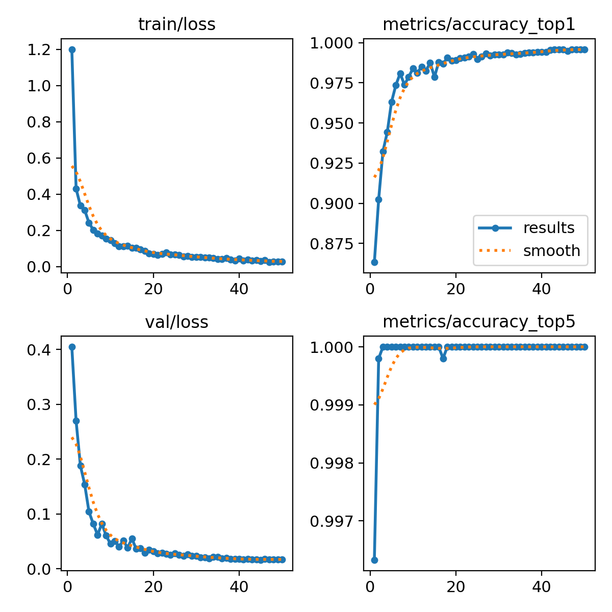

# PV Panel Defect Classification System

## Abstract

This project implements a deep learning pipeline for the automated classification of defects in photovoltaic (PV) panels. It utilizes a Convolutional Neural Network (CNN) trained via transfer learning to identify a spectrum of predefined anomalies from panel imagery. The system is bifurcated into a training module and a user-facing inference application, providing an end-to-end solution for defect analysis.

## Methodology

The core methodology employs **transfer learning** using the **ResNet-18** architecture, pre-trained on the ImageNet dataset. The model's final fully-connected layer is re-trained on a custom dataset of PV panel images to classify them into specific defect categories.

The system's architecture is segmented into two primary components:

### 1. Training Pipeline (`train.py`)
This script orchestrates the model training and validation process. It ingests the structured image dataset, applies data augmentation, and trains the classifier using the Adam optimizer and Cross-Entropy Loss. The script systematically saves the model weights that yield the highest validation accuracy, producing a serialized `.pth` file and plots of the training history.

### 2. Inference Application (`app.py`)
This script provides a practical, user-facing GUI built with Tkinter. It instantiates the ResNet-18 architecture, loads the trained `.pth` weights, and runs the model in evaluation mode. Users can submit a query image, which is preprocessed and passed through the model. The application then returns the predicted class (defect type) and the corresponding confidence score derived from the model's Softmax output.

## Training Results

### Model Accuracy

